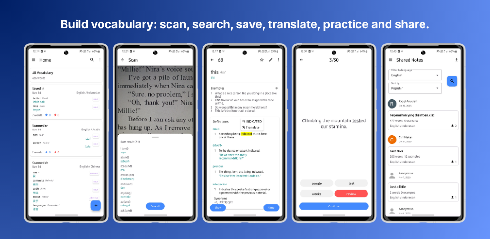

    
  
  
  

# Vocabulens

**Vocabulens** is an open-source vocabulary learning app designed to help users **capture,
understand, and retain words effectively**. It combines note-taking, OCR scanning, and interactive practice into one seamless experience —
making vocabulary learning practical and engaging.

### Features

- 📘 **Your Own Vocabulary** - Create structured vocabulary notes with meanings, examples, and tags.

- 🔄 **Anki Flashcards Export** - Vocabulens allows users to export their saved vocabulary as flashcards to AnkiDroid.
  
- 📶 **Offline Mode** - All vocabulary can still be accessed, searched, and studied without an internet connection.

- 📷 **Scan Words (OCR)** - Capture words directly from books, images, or screenshots.

- 🗣 **Sentence-Based Practice** - Learn words in context with interactive exercises.

- 📥 **Import & Export (CSV)** - Easily manage vocabulary across platforms.

- 🔍 **Built-in Dictionary** - Instantly search English definitions.

- 🔗 **Share Notes** - Share vocabulary publicly or via link.

- ⭐ **Progress Tracking** - Mark words as familiar or unfamiliar.

- ✍️ **Custom Examples** - Add your own sentences for better retention.

## Tech Stack

- **Kotlin (XML)**
- **Hilt**
- **Room**
- **Firebase Auth**
- **Cloud Firestore**
- **ML Kit**
- **Free Dictionary API**
- **AnkiDroid API**

## Contributing

We welcome contributions from the community!

1. Fork the repository
2. Create a new branch (`feature/your-feature`)
3. Commit your changes
4. Open a Pull Request

## License

This project is licensed under the **MIT License**.

## Support

If you find this project helpful:

- Give it a ⭐ on GitHub
- Share it with others
- Contribute to improve it

## Contact

For feedback or ideas:

- Open an issue
- Use in-app feedback

 

  Made with ❤️ for learners worldwide

